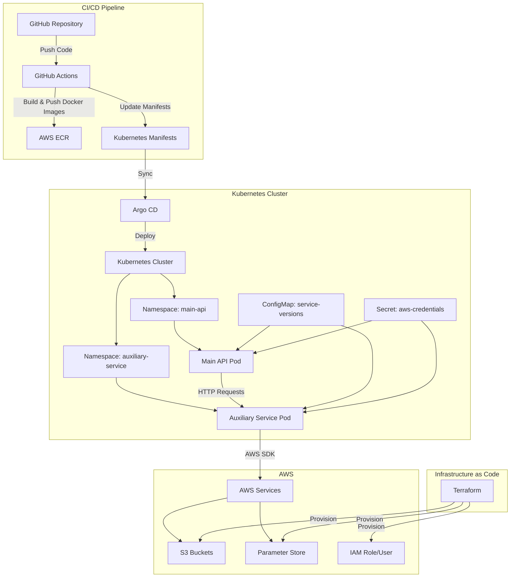

# Kubernetes-native microservices with GitOps (Argo CD), Terraform IaC, AWS integration (ECR, S3, SSM), and a GitHub Actions CI/CD pipeline.

## Architecture Overview
├─ main-api (Flask)  ←→  auxiliary-service (Flask)  ←→  AWS S3 & SSM
│           ↑                                     
│   GitHub Actions builds & pushes Docker images  
│           ↓                                     
├─ Amazon ECR — versioned by git SHA             
│           ↓                                     
├─ Argo CD syncs k8s/ folder                    
│           ↓                                     
└─ Kubernetes cluster (minikube / EKS / etc.)

- **Namespaces**: `argocd`, `main-api`, `auxiliary-service`.
    
- **Terraform**: bootstraps remote state, then S3 bucket, SSM parameters, ECR repos, IAM roles & OIDC.
    
- **GitHub Actions**: builds & tags Docker images (`${{ github.sha }}`), updates k8s manifests, commits.
    
- **Argo CD**: continuously reconciles your `k8s/` folder into the `main-api` and `auxiliary-service` namespaces.

---

## Terraform (IaC)

### Modules (in `terraform/main.tf`)

|Module|Purpose|Key outputs|
|---|---|---|
|**bootstrap**|Remote state bucket & DynamoDB lock|(no external outputs)|
|**s3**|Application object storage bucket|`challenge_bucket_name`|
|**ssm**|AWS Parameter Store entries|`parameter_names`|
|**ecr**|Two ECR repos: `main-api`, `auxiliary-service`|`main_api_repository_arn`, `auxiliary_service_repository_arn`|
|**iam**|OIDC provider, GitHub Actions role, IAM user|`access_key_id`, `secret_access_key` (sensitive)|

### Root variables (`terraform/variables.tf`)

|Name|Default|Description|
|---|---|---|
|`aws_region`|`eu-west-1`|AWS region for all resources|
|`project_name`|`kantox-challenge`|Used as prefix for buckets, repos, etc.|
|`environment`|`dev`|Supports multi-env (e.g. dev / prod)|
|`github_repo`|`Rania193/tech-challenge`|Owner/repo for IAM OIDC trust|

