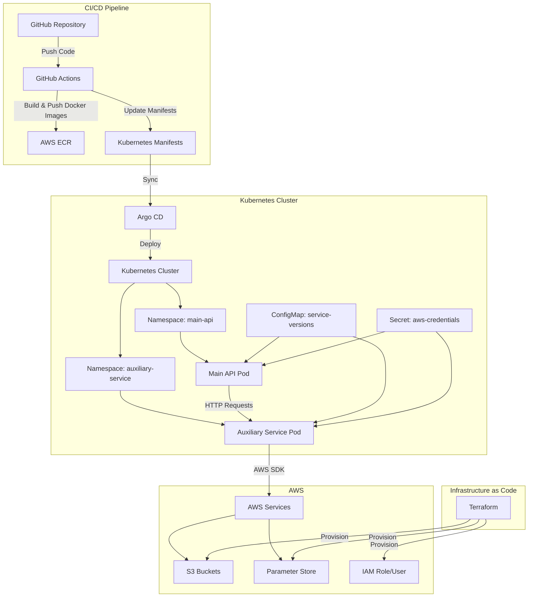

# Kubernetes-native microservices with GitOps (Argo CD), Terraform IaC, AWS integration (ECR, S3, SSM), and a GitHub Actions CI/CD pipeline.

```mermaid
graph TD
    A[GitHub Repository] -->|Push Code| B[GitHub Actions]
    B -->|Build & Push Docker Images| C[AWS ECR]
    B -->|Update Manifests| D[Kubernetes Manifests]
    
    D -->|Sync| E[Argo CD]
    E -->|Deploy| F[Kubernetes Cluster]
    
    F --> G[Namespace: main-api]
    F --> H[Namespace: auxiliary-service]
    
    G --> I[Main API Pod]
    H --> J[Auxiliary Service Pod]
    
    I -->|HTTP Requests| J
    J -->|AWS SDK| K[AWS Services]
    
    K --> L[S3 Buckets]
    K --> M[Parameter Store]
    
    N[Terraform] -->|Provision| L
    N -->|Provision| M
    N -->|Provision| O[IAM Role/User]
    
    P[ConfigMap: service-versions] --> I
    P --> J
    Q[Secret: aws-credentials] --> I
    Q --> J
    
    subgraph CI/CD Pipeline
        A
        B
        C
        D
    end
    
    subgraph Kubernetes Cluster
        E
        F
        G
        H
        I
        J
        P
        Q
    end
    
    subgraph AWS
        K
        L
        M
        O
    end
    
    subgraph Infrastructure as Code
        N
    end
```

