# Cloud Engineer Challenge

* Kubernetes-native Python services  
* GitOps with **Argo CD**  
* Terraform IaC provisioning AWS (ECR · S3 · SSM · IAM/OIDC)  
* CI/CD (trunk-based) on **GitHub Actions**  
* Observability via **Prometheus + Grafana**

---

## Architecture Overview

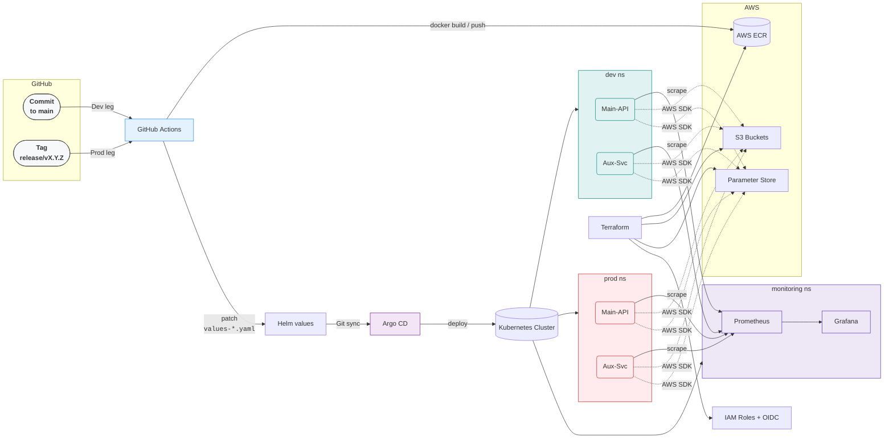

- **Namespaces**: `argocd`, `main-api`, `auxiliary-service`.
    
- **Terraform**: bootstraps remote state, then S3 bucket, SSM parameters, ECR repos, IAM roles & OIDC.
    
- **GitHub Actions**: builds & tags Docker images (`${{ github.sha }}`), updates k8s manifests, commits.
    
- **Argo CD**: continuously reconciles your `k8s/` folder into the `main-api` and `auxiliary-service` namespaces.

#### _Why “one-namespace-per-environment” instead of “one-namespace-per-service-per-environment”_

> In the spec you suggested **“Namespaces for separation (at least one for the Main API, one for the Auxiliary Service … and optionally multi-env).”**  
> For this demo I chose to group the two services by **environment** instead of by **service**:

| Decision                                                                                                | Rationale in a 2-service demo                                                                                                            | When we would switch                                                                                                                                                                                                                                                                                                                                          |
| ------------------------------------------------------------------------------------------------------- | ---------------------------------------------------------------------------------------------------------------------------------------- | ------------------------------------------------------------------------------------------------------------------------------------------------------------------------------------------------------------------------------------------------------------------------------------------------------------------------------------------------------------- |
| **`dev/` and `prod/` namespaces**<br/>(both **Main-API** and **Aux-Svc** live together inside each env) | _• Service discovery is trivial_: `http://auxiliary-service.dev.svc.cluster.local`.<br/>_• Shows the multi-env concept without clutter._ | If the platform grows beyond a handful of micro-services **or** we need stricter blast-radius control, we would adopt **one namespace per environment per service**, e.g. `dev-main-api`, `dev-aux-svc`, `prod-main-api`, … – the Helm charts already template `{{ .Release.Namespace }}`, so it’s a one-line change in each Argo CD `destination.namespace`. |

### Runtime flow (Main → Aux → AWS)
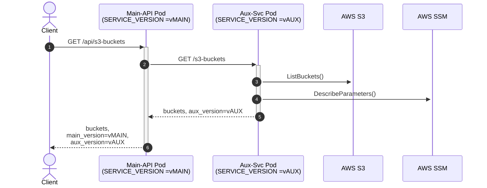
Each pod gets its own SERVICE_VERSION from a ConfigMap at start-up; the value is simply echoed in every JSON response.

---

## Terraform (IaC)

### Modules (in `terraform/main.tf`)

|Module|Purpose|Key outputs|
|---|---|---|
|**bootstrap**|Remote state bucket & DynamoDB lock|(no external outputs)|
|**s3**|Application object storage bucket|`challenge_bucket_name`|
|**ssm**|AWS Parameter Store entries|`parameter_names`|
|**ecr**|Two ECR repos: `main-api`, `auxiliary-service`|`main_api_repository_arn`, `auxiliary_service_repository_arn`|
|**iam**|OIDC provider, GitHub Actions role, IAM user|`access_key_id`, `secret_access_key` (sensitive)|


### Root variables (`terraform/variables.tf`)

|Name|Default|Description|
|---|---|---|
|`aws_region`|`eu-west-1`|AWS region for all resources|
|`project_name`|`kantox-challenge`|Used as prefix for buckets, repos, etc.|
|`environment`|`dev`|Supports multi-env (e.g. dev / prod)|
|`github_repo`|`Rania193/tech-challenge`|Owner/repo for IAM OIDC trust|

### Usage

```bash
cd terraform/bootstrap && terraform init && terraform apply
cd .. && terraform init && terraform apply
```

---

## CI/CD – GitHub Actions `(.github/workflows/deploy.yaml)`


| Trigger                | Matrix leg | Image tag | File bumped        | Target namespace |
| ---------------------- | ---------- | --------- | ------------------ | ---------------- |
| `push` → **main**      | `dev`      | `<sha>`   | `values-dev.yaml`  | **dev**          |
| `push` tag `release/*` | `prod`     | `vX.Y.Z`  | `values-prod.yaml` | **prod**         |

Both legs commit the bump back to main with [skip ci], so they don’t retrigger.
**Steps**:
   1. **Checkout code**  
   2. **Assume AWS role** via OIDC (`aws-actions/configure-aws-credentials@v2`)  
   3. **Login to ECR** (`aws-actions/amazon-ecr-login@v1`)  
   4. **Build & push images**
   5. **Patch** the appropriate `values-*.yaml` with the tag
   6. **Commit & push**

   ---

## Local Deployment Guide

### Prerequisites

- Docker Desktop or Podman  
- `kubectl` ≥ 1.25  
- Minikube v1.36.0
- Terraform v1.7.4 
- Helm  

### 1. Fork or clone the repo
1. **Fork** this repository to your own GitHub account  
2. **Clone** your fork locally:

   ```bash
   git clone https://github.com/<YOUR-USER>/tech-challenge.git
   cd tech-challenge
3. Replace the hard-coded repository string (only three places):

|File|Line(s) to edit|What to change|
|---|---|---|
|`argocd/auxiliary-service-appset.yaml`|`spec.template.spec.source.repoURL`|Replace `https://github.com/Rania193/tech-challenge` with your fork URL|
|`argocd/main-api-appset.yaml`|`spec.template.spec.source.repoURL`|Same replacement|
|`terraform/variables.tf`|`variable "github_repo"` default|Set to `<yourUser>/tech-challenge` (owner/repo)|


```bash
# one-liner (Linux/macOS)
sed -i '' -e 's#Rania193/tech-challenge#<YOUR-USER>/tech-challenge#g' \
  argocd/*.yaml terraform/variables.tf
```

### 2. Deploy Infrastructure on AWS
```bash
cd terraform/bootstrap
terraform init
terraform plan
terraform apply
cd ..
terraform init
terraform plan   # inspect changes
terraform apply  # provision AWS infra
```
### 3. Setup your cluster
```bash
minikube start

# Create required namespaces
kubectl create namespace argocd
kubectl create namespace dev
kubectl create namespace prod
kubectl create namespace monitoring
```

### 4. Install Argo CD and Login

Add Argo Helm Repo

```bash
helm repo add argo https://argoproj.github.io/argo-helm
helm repo update
```
Install Argo CD with Helm
```bash
cd argocd
helm install argocd argo/argo-cd \
  --namespace argocd \
  --create-namespace \
  -f values.yaml
```
Access the Argo CD UI
```bash
minikube service argocd-server -n argocd --url
```

To login
```bash
# Username: admin
# Get password:
kubectl -n argocd get secret argocd-initial-admin-secret   -o jsonpath='{.data.password}' | base64 -d && echo
```

Apply the applications
```bash
kubectl apply -f argocd/
```
`/argocd` directory contains two ApplicationSet
objects (one per chart) that point to
`myhelmcharts/charts/<service>` and track values-dev.yaml or
values-prod.yaml depending on the destination namespace.

Argo CD notices the new ApplicationSets, renders the charts, and
performs a `helm upgrade --install …`inside the cluster.
ArgoCD now syncs `dev` & `prod` automatically.


### 5. Cluster ECR Pull Permissions

Generate the temporary token:
```bash
TOKEN=$(aws ecr get-login-password --region eu-west-1)
```
Then create a secret of type docker-registry with it in namespaces `dev` and `prod`
```bash
kubectl create secret docker-registry regcred \
  --docker-server=${AWS_ACCOUNT}.dkr.ecr.${AWS_REGION}.amazonaws.com \
  --docker-username=AWS \
  --docker-password=$TOKEN \
  --namespace=dev
  ```
  ```bash
  kubectl create secret docker-registry regcred \
  --docker-server=${AWS_ACCOUNT}.dkr.ecr.${AWS_REGION}.amazonaws.com \
  --docker-username=AWS \
  --docker-password=$TOKEN \
  --namespace=prod
  ```
  Make sure to have `AWS_ACCOUNT` and `AWS_REGION` environment variables set to your own values.

Also create an `aws-credentials` secret in the `dev` and `prod` namespaces with your AWS keys, as the auxiliary service will need it to communicate with AWS.
```bash
kubectl create secret generic aws-credentials \ --from-literal=AWS_ACCESS_KEY_ID= \ --from-literal=AWS_SECRET_ACCESS_KEY= \ -n dev
```
```bash
kubectl create secret generic aws-credentials \ --from-literal=AWS_ACCESS_KEY_ID= \ --from-literal=AWS_SECRET_ACCESS_KEY= \ -n prod
```

#### Optional: Auto-Refresh ECR Pull-Secret (Cronjob)
You can create a cronjob to refresh the Docker credentials for your cluster every 12 hours instead of doing it manually. This is because the project is deployed on minikube (local cluster)

Create a file at `/usr/local/bin/aws-ecr-update-credentials.sh` with the following contents:

```bash
#!/usr/bin/env bash
set -euo pipefail

# ─── CONFIGURATION ────────────────────────────────────────────────────────────
AWS_REGION="eu-west-1"
AWS_ACCOUNT="your-AWS-account-ID"
# ────────────────────────────────────────────────────────────────────────────────

# Fetch a fresh ECR token
TOKEN=$(aws ecr get-authorization-token \
  --region "$AWS_REGION" \
  --output text \
  --query 'authorizationData[].authorizationToken' \
  | base64 -d \
  | cut -d: -f2)

# Find all namespaces that have the 'regcred' secret
namespaces=()
while IFS= read -r ns; do
  namespaces+=("$ns")
done < <(
  kubectl get secret --all-namespaces \
    | awk '/regcred/ {print $1}'
)

# Rotate the secret in each namespace
for ns in "${namespaces[@]}"; do
  echo "$(date '+%Y-%m-%d %H:%M:%S')  Updating 'regcred' in namespace: $ns"
  kubectl delete secret regcred -n "$ns" 2>/dev/null || true
  kubectl create secret docker-registry regcred \
    --docker-server="${AWS_ACCOUNT}.dkr.ecr.${AWS_REGION}.amazonaws.com" \
    --docker-username=AWS \
    --docker-password="$TOKEN" \
    --namespace="$ns"
done
```
Save the file

Make it executable
```bash
sudo chmod +x /usr/local/bin/aws-ecr-update-credentials.sh
```
Prepare the log directory
```bash
mkdir -p ~/logs
```
Edit your crontab:


```bash
crontab -e
```
Add the following lines:

```bash
SHELL=/bin/bash
# Rotate ECR pull-secret at 00:00 and 12:00 daily
0 */12 * * * /usr/local/bin/aws-ecr-update-credentials.sh \
  >> $HOME/logs/aws-ecr-update-credentials.log 2>&1
```

## Verifying a Successful Release

```bash
kubectl get pods -n dev
kubectl get pods -n prod
# Should be READY 1/1

# Port-forward Main API:
kubectl port-forward svc/main-api -n dev 8000:8000 # or -n prod
curl -s http://localhost:8000/s3-buckets | jq
```

You’ll see bucket names and service versions.

---

## API Testing Guide

### List S3 buckets

```bash
curl -s http://<MAIN_API_HOST>:8000/s3-buckets | jq
```

**Sample response:**

```json
{
  "auxiliary_service_version": "abcd1234...",
  "buckets": ["kantox-challenge-dev-bucket", "kantox-challenge-terraform-state"],
  "main_api_version": "abcd1234..."
  
}
```

### List all parameters

```bash
curl -s http://<MAIN_API_HOST>:8000/parameters | jq
```
**Sample response:**
```json
{
  "auxiliary_service_version": "abcd1234...",
  "main_api_version": "abcd1234...",
  "parameters": [
    "/kantox-challenge/dev/param1",
    "/kantox-challenge/dev/param2"
  ]
  
}
```

### Get a single parameter

```bash
curl -s http://<MAIN_API_HOST>:8000/parameter/<param_name> | jq
```
**Sample response:**
```json
{
  "auxiliary_service_version": "abcd1234...",
  "main_api_version": "abcd1234...",
  "value": "<param_name>"
  
}
```

## Monitoring

1. **Install kube-prometheus-stack**

     ```bash
    helm repo add prometheus-community https://prometheus-community.github.io/helm-charts
    helm repo update

    helm upgrade --install monitoring prometheus-community/kube-prometheus-stack \
    --namespace monitoring --create-namespace \
    --set grafana.adminPassword='admin' \
    --set prometheus.prometheusSpec.serviceMonitorSelectorNilUsesHelmValues=false
    ```

2. **Components**

    - **Prometheus**: collects metrics from the cluster (node-exporter, kubelet/cAdvisor) and the application pods.  
    - **Grafana**: visualization layer.

3. **Enable Minikube Metrics Server**

    ```bash
    minikube addons enable metrics-server
    ```

4. **Deploy the pod monitors**

    ```bash
    kubectl apply -f k8s/monitoring
    ```

5. **Verify Prometheus Targets**

    ```bash
    kubectl port-forward svc/monitoring-kube-prometheus-prometheus -n monitoring 9090
    ```

    Then open your browser to:  
    ```
    http://localhost:9090/targets
    ```

6. **Grafana**

    ```bash
    kubectl port-forward svc/monitoring-grafana -n monitoring 3000:80
    ```

    Then visit:  
    ```
    http://localhost:3000
    ```
    - **User**: `admin`  
    - **Pass**: `admin` (or whatever you set above)

7. **Build a Dashboard Panel**

    - Click **+** → **Dashboard** → **Add new panel**  
    - **Visualization**: Time series  
    - **Queries Examples**:

      ```promql
      # CPU usage by pod (cores)
      sum(rate(container_cpu_usage_seconds_total{namespace="dev"}[5m])) by (pod)
      ```
 
      ```promql
      # Memory usage by pod (MiB)
      sum(container_memory_usage_bytes{namespace="dev"}) by (pod) / (1024 * 1024)
      ```

## My results

### Cluster Resources

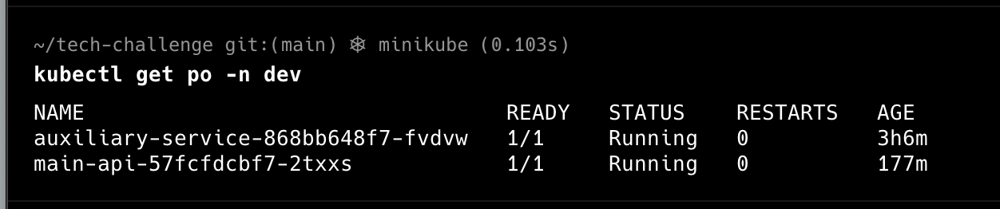

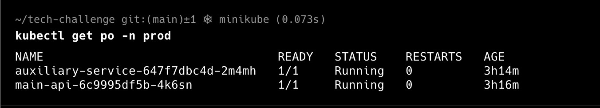

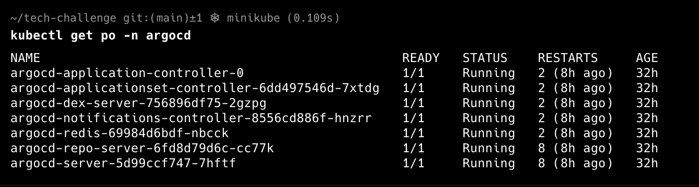

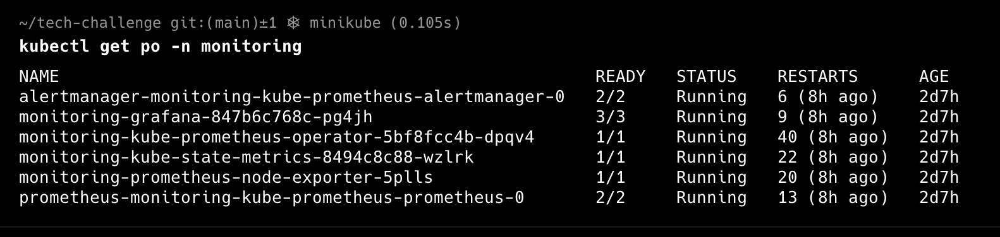

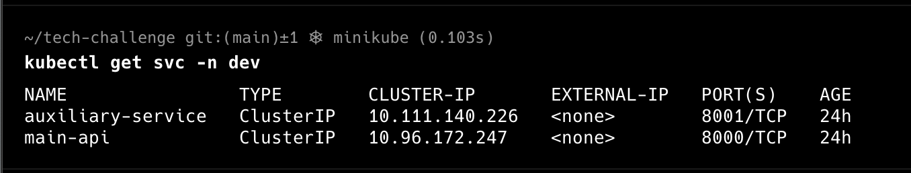

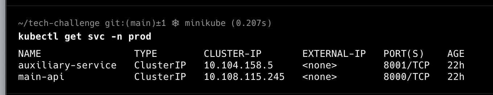

### API Responses

#### Main API dev
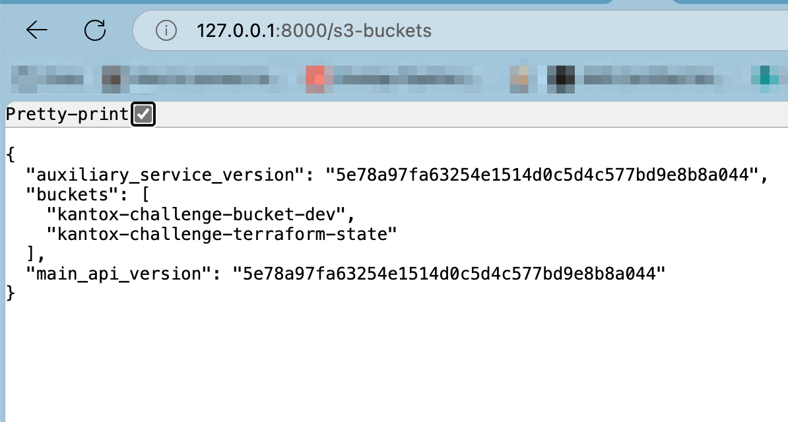

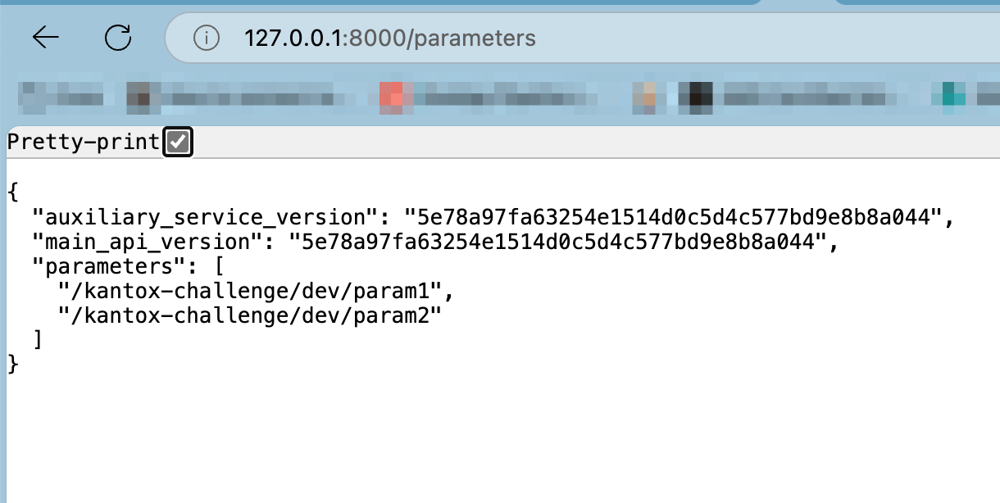

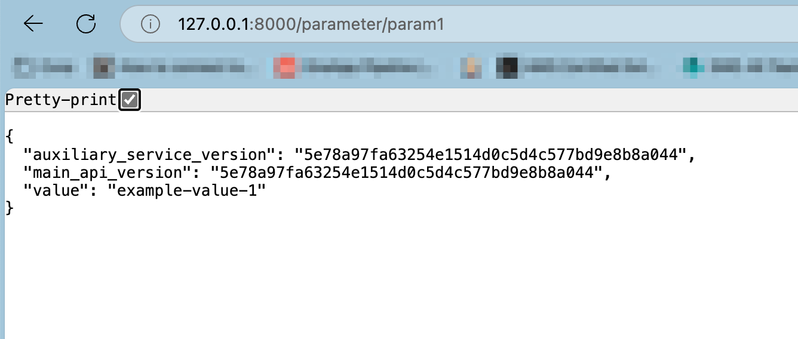

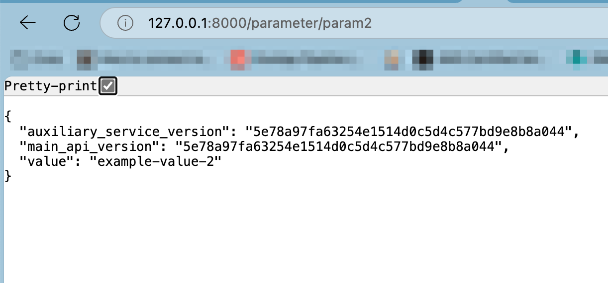

#### Main API prod
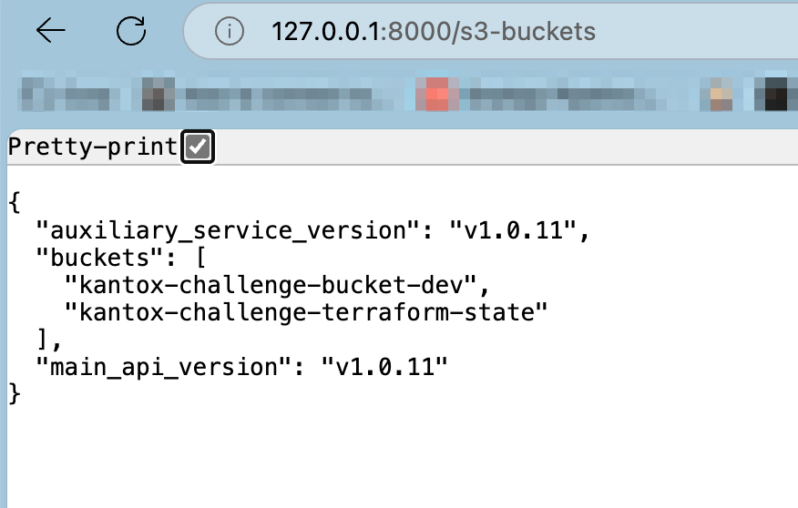

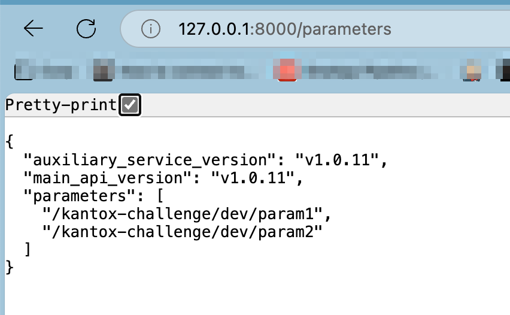

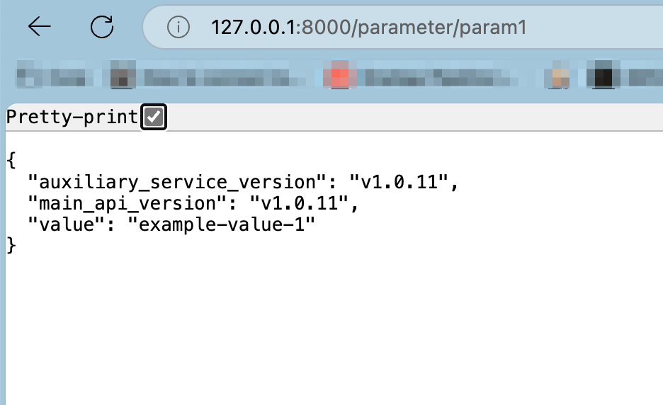

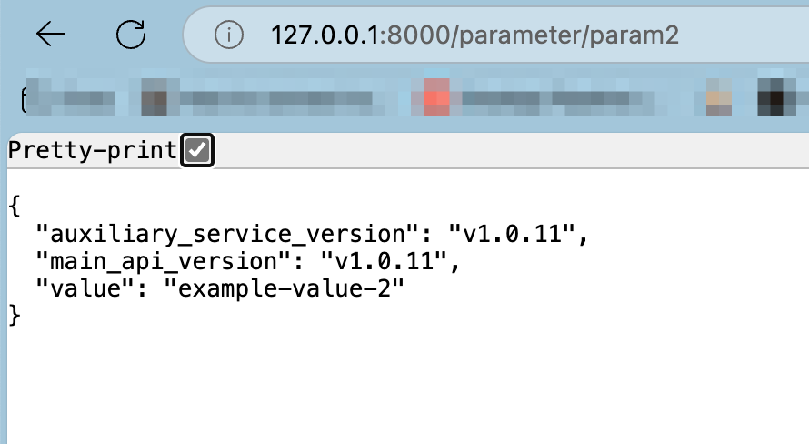

### ArgoCD Configuration

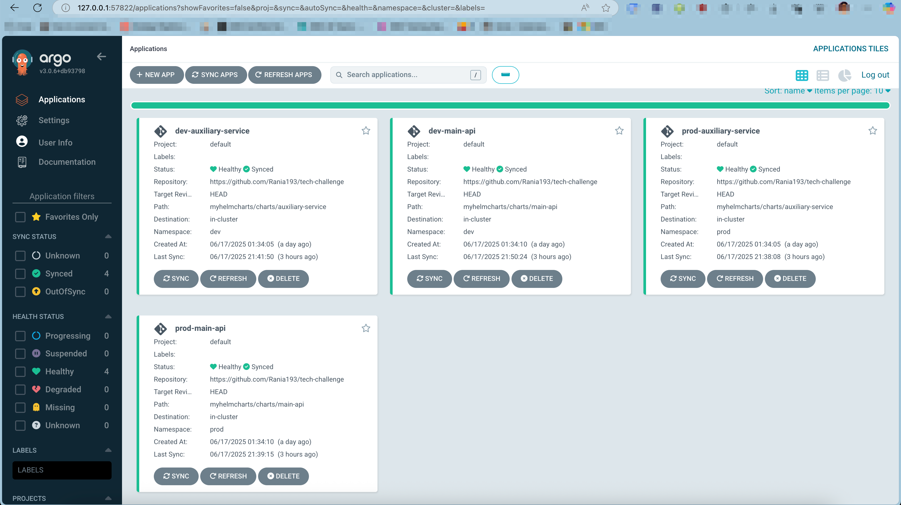

### Grafana: CPU and Memory Usage by Pod

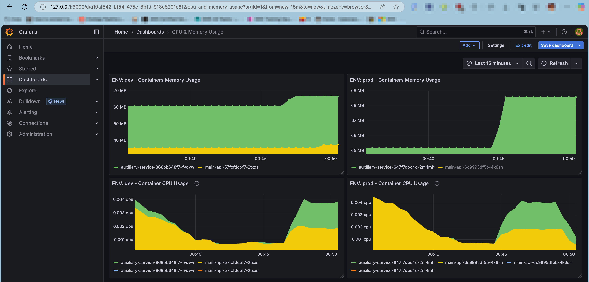


## Possible Improvements
The project intentionally keeps some things simple.

Below are some of the compromises I'm aware of and how I would tackle them in a production engagement.


| Area                       | Demo shortcut                                                                                             | Why it’s OK for now                                                                        | How we’d harden / scale                                                                                                                                                                                                                                                                                                                                                                                           |
| -------------------------- | --------------------------------------------------------------------------------------------------------- | ------------------------------------------------------------------------------------------ | ----------------------------------------------------------------------------------------------------------------------------------------------------------------------------------------------------------------------------------------------------------------------------------------------------------------------------------------------------------------------------------------------------------------- |
| **IAM for pods**           | Workloads use an **IAM user key** mounted as a Secret (`aws-credentials`).                                | Easiest to demo; avoids extra cluster add-ons.                                             | Use IRSA (EKS) or `kiam/karpenter-external-secrets` on vanilla k8s → each ServiceAccount gets its own STS role; no static keys.                                                                                                                                                                                                                                                                                   |
| **ECR pull secret**        | Manual token + optional cronjob to rotate every 12 h.                                                     | Fine on Minikube / Kind.                                                                   | On EKS use `imagePullSecrets` via IAM-based OIDC, or the ECR credential provider plugin.                                                                                                                                                                                                                                                                                                                          |
| **Helm chart version**     | Chart `version` left at `0.1.0`; only the **app** version is bumped.                                      | Keeps the Git diff small for the demo.                                                     | Bump Chart version automatically (e.g. `helm cm-push`) whenever templates change; sign and upload to an OCI-based chart registry.                                                                                                                                                                                                                                                                                 |
| **Networking**             | Pods talk via ClusterIP DNS; no Ingress/HTTPS.                                                            | Works inside Minikube; avoids cert setup.                                                  | Expose through Ingress/ALB or API Gateway with HTTPS, HSTS, WAF rules.                                                                                                                                                                                                                                                                                                                                            |
| **Readiness / HPA**        | Single replica, no probes, no autoscaling.                                                                | Keeps yamls concise.                                                                       | Add liveness/readiness endpoints, CPU/memory HPA, pod disruption budgets.                                                                                                                                                                                                                                                                                                                                         |
| **Hard-coded repo URL**    | Reviewer must search-replace `Rania193/tech-challenge` in three files.                                    | Keeps manifests YAML-only.                                                                 | Convert Argo CD manifests into a tiny Helm chart with `repoURL` as a value, or use Kustomize patches.                                                                                                                                                                                                                                                                                                             |
| **Git workflow**           | Ultra-simple **trunk-based** flow: <br/>_push to `main` → dev_<br/>_tag `release/*` → prod                | Keeps the exercise small, zero merge complexity.                                           | Adopt _feature-branch + PR review_ (or Git Flow) for larger teams; enforce protected branches, status checks, CODEOWNERS, and maybe use _release branches_ for multiple versions in flight.                                                                                                                                                                                                                       |
| **Single CI IAM role**     | One role (`github-actions-app-dev`) drives **all** CI tasks for both dev and prod environments.           | Reduces Terraform clutter; you can push both `<sha>` and `vX.Y.Z` tags into the same repo. | Create separate OIDC roles for dev and prod, maybe prod role will have permission to publish images to prod repos (have separate ECR repos too)                                                                                                                                                                                                                                                                   |
| **Terraform environments** | Single TF root executed once (`terraform apply`) for *both* dev & prod. One state bucket, one lock table. | Keeps the interview demo to two `apply` commands; no need to juggle workspaces.            | Split state **per environment**:<br/>* **Option A – workspaces**: `terraform workspace new prod`, separate state files in the same bucket.<br/>* **Option B – folder-per-env**: `terraform/dev` & `terraform/prod`, each with its own backend (bucket and lock table) and its own GitHub Actions role.<br/>Add CI jobs `terraform-plan-dev` + `terraform-plan-prod`, enforce PR approval before applying to prod. |

