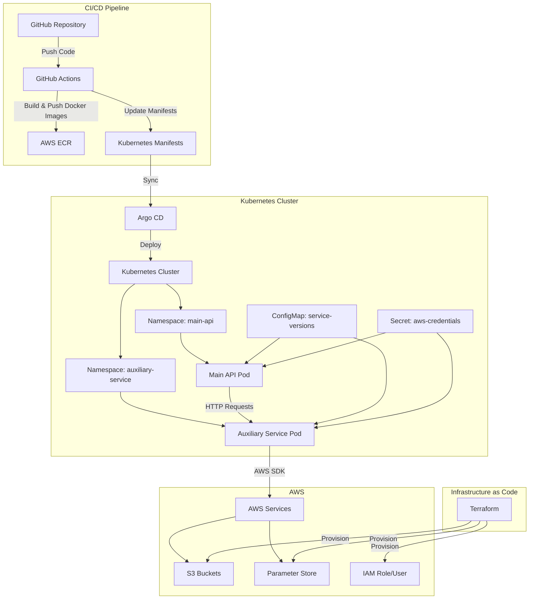
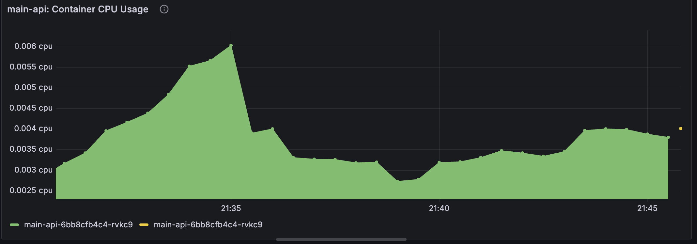
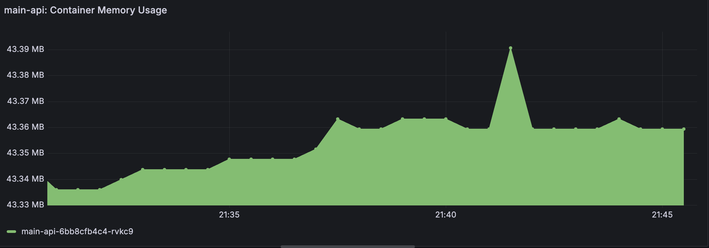

# Cloud Engineer Challenge

Kubernetes-native microservices with GitOps (Argo CD), Terraform IaC, AWS integration (ECR, S3, SSM), a GitHub Actions CI/CD pipeline, and monitoring with Prometheus and Grafana.

## Architecture Overview



- **Namespaces**: `argocd`, `main-api`, `auxiliary-service`.
    
- **Terraform**: bootstraps remote state, then S3 bucket, SSM parameters, ECR repos, IAM roles & OIDC.
    
- **GitHub Actions**: builds & tags Docker images (`${{ github.sha }}`), updates k8s manifests, commits.
    
- **Argo CD**: continuously reconciles your `k8s/` folder into the `main-api` and `auxiliary-service` namespaces.

---

## Terraform (IaC)

### Modules (in `terraform/main.tf`)

|Module|Purpose|Key outputs|
|---|---|---|
|**bootstrap**|Remote state bucket & DynamoDB lock|(no external outputs)|
|**s3**|Application object storage bucket|`challenge_bucket_name`|
|**ssm**|AWS Parameter Store entries|`parameter_names`|
|**ecr**|Two ECR repos: `main-api`, `auxiliary-service`|`main_api_repository_arn`, `auxiliary_service_repository_arn`|
|**iam**|OIDC provider, GitHub Actions role, IAM user|`access_key_id`, `secret_access_key` (sensitive)|


### Root variables (`terraform/variables.tf`)

|Name|Default|Description|
|---|---|---|
|`aws_region`|`eu-west-1`|AWS region for all resources|
|`project_name`|`kantox-challenge`|Used as prefix for buckets, repos, etc.|
|`environment`|`dev`|Supports multi-env (e.g. dev / prod)|
|`github_repo`|`Rania193/tech-challenge`|Owner/repo for IAM OIDC trust|

### Usage

```bash
cd terraform/bootstrap
terraform init
terraform plan
terraform apply
cd ..
terraform init
terraform plan   # inspect changes
terraform apply  # provision AWS infra
```

---

## CI/CD – GitHub Actions

File: `.github/workflows/ci-cd-pipeline.yml`

1. **Trigger**: push to `main`.  
2. **Permissions**:  
   - `id-token: write` (GitHub OIDC)  
   - `contents: write` (to push manifest updates)  
3. **Steps**:
   1. **Checkout code**  
   2. **Assume AWS role** via OIDC (`aws-actions/configure-aws-credentials@v2`)  
   3. **Login to ECR** (`aws-actions/amazon-ecr-login@v1`)  
   4. **Build & push images** (tagged `${{ github.sha }}`)  
   5. **Patch manifests** (`sed -i` updates images + configmap versions)  
   6. **Commit & push** updated `k8s/` manifests  

   ---

   ## Local Deployment Guide

### Prerequisites

- Docker Desktop or Podman  
- `kubectl` ≥ 1.25  
- Minikube v1.36.0
- Terraform ≥ 1.7  
- (Optional) Helm  

### 1. Deploy Infrastructure on AWS
```bash
cd terraform/bootstrap
terraform init
terraform plan
terraform apply
cd ..
terraform init
terraform plan   # inspect changes
terraform apply  # provision AWS infra
```
### 2. Start your cluster
```bash
minikube start
```


### 3. Install Argo CD and Login

Add Argo Helm Repo

```bash
helm repo add argo https://argoproj.github.io/argo-helm
helm repo update
```
Install Argo CD with Helm
```bash
cd argocd
helm install argocd argo/argo-cd \
  --namespace argocd \
  --create-namespace \
  -f values.yaml
```
Access the Argo CD UI
```bash
minikube service argocd-server -n argocd --url
```

To login
```bash
# Username: admin
# Get password:
kubectl -n argocd get secret argocd-initial-admin-secret   -o jsonpath='{.data.password}' | base64 -d && echo
```

Apply the application
```bash
kubectl apply -f argocd-application.yaml
```

### 4. Cluster ECR Pull Permissions

Generate the temporary token:
```bash
TOKEN=$(aws ecr get-login-password --region eu-west-1)
```
Then create a secret of type docker-registry with it in namespaces `main-api` and `auxiliary-service`
```bash
kubectl create secret docker-registry regcred \
  --docker-server=${AWS_ACCOUNT}.dkr.ecr.${AWS_REGION}.amazonaws.com \
  --docker-username=AWS \
  --docker-password=$TOKEN \
  --namespace=main-api
  ```
  ```bash
  kubectl create secret docker-registry regcred \
  --docker-server=${AWS_ACCOUNT}.dkr.ecr.${AWS_REGION}.amazonaws.com \
  --docker-username=AWS \
  --docker-password=$TOKEN \
  --namespace=auxiliary-service
  ```
  Make sure to store to have `AWS_ACCOUNT` and `AWS_REGION` environment variables set to your own values.

Also create an `aws-credentials` secret in the `auxiliary-service` namespace with your AWS keys.
```bash
kubectl create secret generic aws-credentials \ --from-literal=AWS_ACCESS_KEY_ID= \ --from-literal=AWS_SECRET_ACCESS_KEY= \ -n auxiliary-service
```

#### Optional: Auto-Refresh ECR Pull-Secret (Cronjob)
You can create a cronjob to refresh the Docker credentials for your cluster every 12 hours instead of doing it manually.
Create a file at `/usr/local/bin/aws-ecr-update-credentials.sh` with the following contents:

```bash
#!/usr/bin/env bash
set -euo pipefail

# ─── CONFIGURATION ────────────────────────────────────────────────────────────
AWS_REGION="eu-west-1"
AWS_ACCOUNT="your-AWS-account-ID"
# ────────────────────────────────────────────────────────────────────────────────

# Fetch a fresh ECR token
TOKEN=$(aws ecr get-authorization-token \
  --region "$AWS_REGION" \
  --output text \
  --query 'authorizationData[].authorizationToken' \
  | base64 -d \
  | cut -d: -f2)

# Find all namespaces that have the 'regcred' secret
namespaces=()
while IFS= read -r ns; do
  namespaces+=("$ns")
done < <(
  kubectl get secret --all-namespaces \
    | awk '/regcred/ {print $1}'
)

# Rotate the secret in each namespace
for ns in "${namespaces[@]}"; do
  echo "$(date '+%Y-%m-%d %H:%M:%S')  Updating 'regcred' in namespace: $ns"
  kubectl delete secret regcred -n "$ns" 2>/dev/null || true
  kubectl create secret docker-registry regcred \
    --docker-server="${AWS_ACCOUNT}.dkr.ecr.${AWS_REGION}.amazonaws.com" \
    --docker-username=AWS \
    --docker-password="$TOKEN" \
    --namespace="$ns"
done
```
Save the file

Make it executable
```bash
sudo chmod +x /usr/local/bin/aws-ecr-update-credentials.sh
```
Prepare the log directory
```bash
mkdir -p ~/logs
```
Edit your crontab:


```bash
crontab -e
```
Add the following lines:

```bash
SHELL=/bin/bash
# Rotate ECR pull-secret at 00:00 and 12:00 daily
0 */12 * * * /usr/local/bin/aws-ecr-update-credentials.sh \
  >> $HOME/logs/aws-ecr-update-credentials.log 2>&1
```

### 5. Create the Argo CD Application

```bash
kubectl apply -f argocd/kantox-challenge-app.yaml
```

Argo CD will now watch `k8s/` and auto-reconcile the services.

## Verifying a Successful Release

```bash
kubectl get pods -n main-api
kubectl get pods -n auxiliary-service
# Should be READY 1/1

# Port-forward Main API:
kubectl port-forward svc/main-api -n main-api 8000:8000
curl -s http://localhost:8000/s3-buckets | jq
```

You’ll see bucket names and matching version hashes.

---

## API Testing Guide

### List S3 buckets

```bash
curl -s http://<MAIN_API_HOST>:8000/s3-buckets | jq
```

**Sample response:**

```json
{
  "buckets": ["kantox-challenge-dev-bucket", ...],
  "main_api_version": "abcd1234...",
  "auxiliary_service_version": "abcd1234..."
}
```

### List all parameters

```bash
curl -s http://<MAIN_API_HOST>:8000/parameters | jq
```

### Get a single parameter

```bash
curl -s http://<MAIN_API_HOST>:8000/parameter/<param_name> | jq
```

## Monitoring

1. **Install kube-prometheus-stack**

    ```bash
    helm repo add prometheus-community https://prometheus-community.github.io/helm-charts
    helm repo update

    helm upgrade --install monitoring prometheus-community/kube-prometheus-stack \
    --namespace monitoring --create-namespace \
    --set grafana.adminPassword='admin' \
    --set prometheus.prometheusSpec.serviceMonitorSelectorNilUsesHelmValues=false
    ```

2. **Components**

    - **Prometheus**: collects metrics from the cluster (node-exporter, kubelet/cAdvisor) and the application pods.  
    - **Grafana**: visualization layer.

3. **Enable Minikube Metrics Server**

    ```bash
    minikube addons enable metrics-server
    ```

4. **Verify Prometheus Targets**

    ```bash
    kubectl port-forward svc/monitoring-kube-prometheus-prometheus -n monitoring 9090
    ```

    Then open your browser to:  
    ```
    http://localhost:9090/targets
    ```

5. **Explore Dashboards in Grafana**

    ```bash
    kubectl port-forward svc/monitoring-grafana -n monitoring 3000:80
    ```

    Then visit:  
    ```
    http://localhost:3000
    ```
    - **User**: `admin`  
    - **Pass**: `admin` (or whatever you set above)

6. **Build a Dashboard Panel**

    - Click **+** → **Dashboard** → **Add new panel**  
    - **Visualization**: Time series  
    - **Queries**:

      ```promql
      # CPU usage by pod (cores)
      sum(rate(container_cpu_usage_seconds_total{namespace="main-api"}[5m])) by (pod)
      ```

      ```promql
      # Memory usage by pod (MiB)
      sum(container_memory_usage_bytes{namespace="main-api"}) by (pod) / (1024 * 1024)
      ```

## My results

### Grafana: CPU Usage by Pod

Below is the CPU usage for all `main-api` pods over the last 15 minutes:



---

### Grafana: Memory Usage by Pod

This chart shows the memory footprint (in MiB) of each `main-api` pod over the last 15 minutes:


